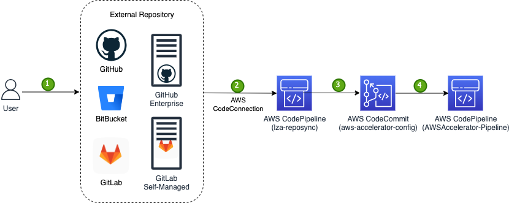
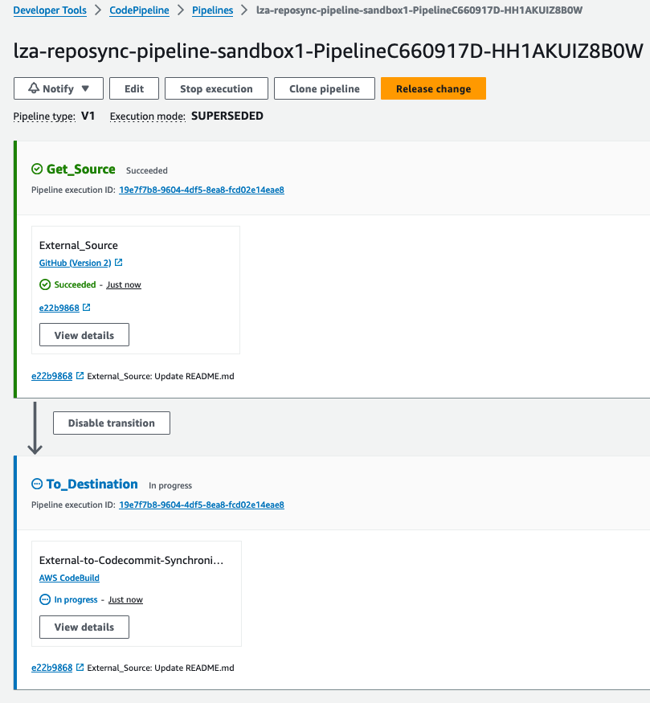

# sample-repository-sync-code-for-landing-zone-accelerator

## Description

At present, the [Landing Zone Accelerator on AWS Solution](https://aws.amazon.com/solutions/implementations/landing-zone-accelerator-on-aws/) supports storing the LZA configuration repository exclusively in AWS CodeCommit. However, there may be instances where organizations need to leverage alternative code hosting platforms (e.g. GitHub, BitBucket) to adhere to their established standards and policies.

To address the need for compatibility with various code hosting platforms, we have developed a solution (let's call it `LZA-RepoSync` for short) to show how to sync repository from external repository to CodeCommit. LZA-RepoSync enables the seamless and secure synchronization of external repositories with the AWS CodeCommit repository, facilitating automatic and contiuous integration.

While the LZA-RepoSync solution was primarily developed to address the specific requirements of the LZA solution, it is also suitable for other use cases beyond its original intended purpose.

## Workflow



1. The user commits changes to the external repository hosted on a supported platform compatible with AWS CodeConnection, such as Bitbucket, GitHub, GitHub Enterprise Server, GitLab, or GitLab Self-Managed.

2. This commit event triggers the lza-reposync pipeline via the AWS CodeConnection service.

3. The lza-reposync solution securely synchronizes the changes from the external repository to the designated AWS CodeCommit repository.

4. Upon successful synchronization, this event initiates the AWSAccelerator-Pipeline, facilitating the subsequent stages of the LZA deployment process.

## Repository Structure

- [cloudformation](./cloudformation/): Environment agnostic Cloudformation templates for building lza-reposync stacks.
- [config](./config): Configuration files for lza-reposync stacks.
- [diagrams](./diagrams): Design diagrams.

## Dependencies

- An external repository that is hosted on AWS CodeConnection compatible platforms (Bitbucket, GitHub, GitHub Enterprise Server, GitLab, or GitLab Self-Managed).
- A CodeCommit repository in the target AWS account.
- A CodeConnection to the external code hosting platform in the target AWS account. Please follow the [instruction](https://docs.aws.amazon.com/dtconsole/latest/userguide/connections.html) to create a connection if you don't have one yet.

## Usage

### Create Stack

- Option 1: AWS Console

  Use the template [pipeline.yaml](./cloudformation/pipeline.yaml) to create the lza-reposync stack in AWS CloudFormation console.

  For example:

  

- Option 2: Command Line

  Clone the repository, then refer [sample.env](./config/sample.env) to create your own config file under [config](./config) folder. Setup AWS credential and run `make ENV=./config/<config_file_name> deploy-pipeline`.

  For example:

  ```
  ➜  ~ git clone https://github.com/aws-samples/sample-repository-sync-code-for-landing-zone-accelerator.git lza-reposync

  ➜  ~ cd lza-reposync

  ➜  lza-reposync git:(main) ✗ make ENV=./config/sandbox.env deploy-pipeline
  Deploying lza-reposync-pipeline-sandbox stack...
  aws cloudformation deploy \
          --stack-name lza-reposync-pipeline-sandbox \
          --template-file ./cloudformation/pipeline.yaml \
          --capabilities CAPABILITY_NAMED_IAM \
          --no-fail-on-empty-changeset \
          --parameter-overrides \
          ExternalRepositoryOwner=jc1518 \
          ExternalRepository=lza-reposync-sample \
          ExternalBranch=master \
          CodeConnection=arn:aws:codestar-connections:ap-southeast-2:xxxxxxxxxx:connection/xxxxxx-xxxx-xxxx-xxxx-xxxxxxxxxxxx \
          CodecommitRepository=aws-accelerator-config \
          CodecommitBranch=main \
          ForceGitPush=yes

  Waiting for changeset to be created..
  Waiting for stack create/update to complete
  Successfully created/updated stack - lza-reposync-pipeline-sandbox
  ```

After the stack creation process is complete, you should be able to observe a newly created pipeline (with a name resembling lza-reposync-pipeline-xxxxxxxx) in the CodePipeline console. This new pipeline will be automatically triggered to synchronize any changes from the external repository/branch to the corresponding CodeCommit repository/branch whenever new commits are pushed to the external repository/branch.



### Delete Stack

Delete the lza-reposync-pipeline-xxxxx stack from CloudFormation console, or run the command line `make ENV=./config/<config_file_name> remove-pipeline`.

## Development

Install [cfn-lint](https://github.com/aws-cloudformation/cfn-lint) and [cfn_nag](https://github.com/stelligent/cfn_nag).

Run `make lint` and `make scan` for syntax check and security scan respectively if you modify the [pipeline.yaml](./cloudformation/pipeline.yaml) CloudFormation template.

For example:

```
➜  lza-reposync git:(main) ✗ cfn-lint --version
cfn-lint 0.87.3

➜  lza-reposync git:(main) ✗ cfn_nag --version
0.8.10

➜  lza-reposync git:(main) ✗ make lint
cfn-lint --info --ignore-checks W3005 -- ./cloudformation/*.yaml
2024-05-24 16:58:18,618 - cfnlint.runner - INFO - Run scan of template cloudformation/pipeline.yaml

➜  lza-reposync git:(main) ✗ make scan
cfn_nag ./cloudformation/*.yaml
------------------------------------------------------------
./cloudformation/pipeline.yaml
------------------------------------------------------------
Failures count: 0
Warnings count: 0
```

## Security

See [CONTRIBUTING](CONTRIBUTING.md#security-issue-notifications) for more information.

## License

This library is licensed under the MIT-0 License. See the [LICENSE](./LICENSE) file.
